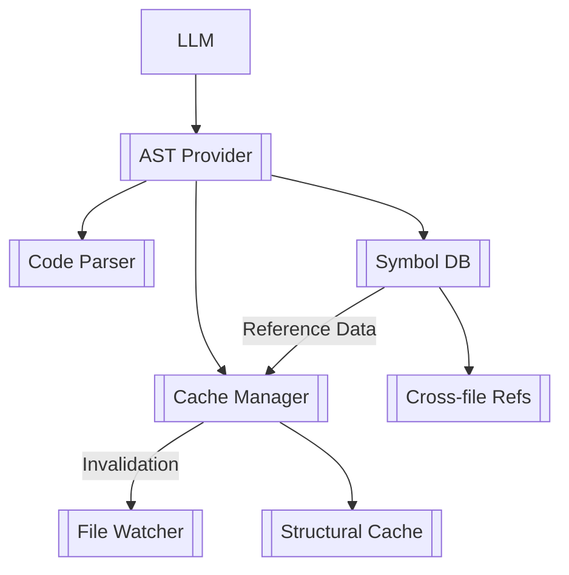
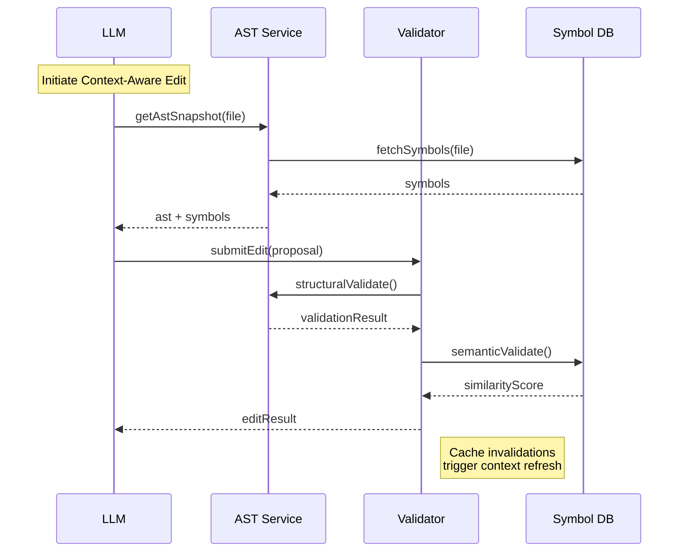
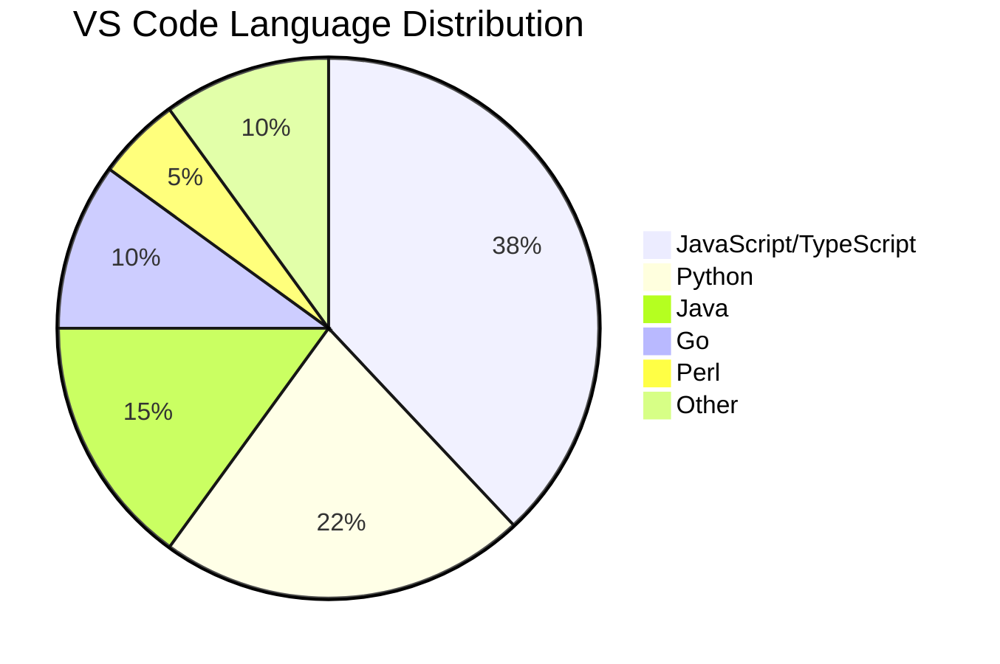
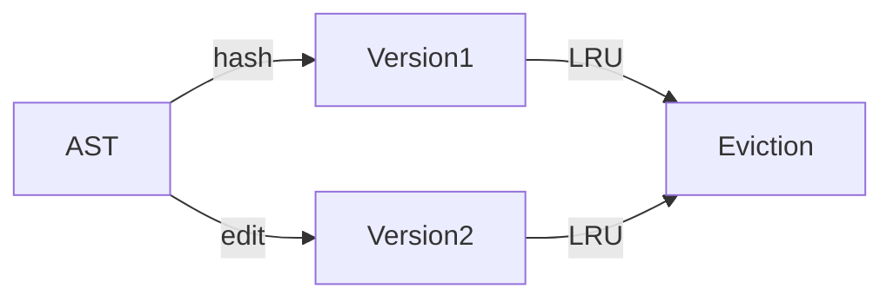

# AST-LLM Integration Protocol v3

Purpose: Make the LLM understand the code structure and semantics for this vs code extenstion.
Goal: Make this extension more intelligent and better at understanding the code structure and semantics. Effectively use context token windows to avoid hallucinating imports and provide more accurate type matching. The design should be well integrated with existing code code. We want this extension to be able to surgically edit code without losing context

Problem example:

- If there are too many line codes in one single file, the LLM unable to understand the code structure and semantics.
- If there are too many line codes in single file, the LLM has difficulity edit or insert code changes, for example this warning message:
  <error_details>
  Failed to find a matching location in the file (16% confidence, needs 80%)

Debug Info:

- Search Strategy Used: levenshtein
- Context Lines: 6 out of 31 total lines (19%)
- Attempted to split into 1 sub-hunks but still failed

Possible Issues:

- Not enough context lines to uniquely identify the location
- Add a few more lines of unchanged code around your changes

</error_details>

## Structural Understanding Framework



## Implementation Blueprint

### 1. AST Service Initialization (src/core/ast/AstService.ts)

```typescript
import { Parser, Language, Tree } from "web-tree-sitter"
import { logger } from "../../utils/logging"
import { AstCacheManager } from "../cache/AstCacheManager"

export class AstProvider {
	private parserPool = new Map<string, Parser>()
	private activeTrees = new Map<string, Tree>()

	async initialize() {
		await this.loadLanguageParsers(["typescript", "javascript"])
		AstCacheManager.initStructuralInvalidationHooks()
		logger.info("AST service initialized with TS/JS support")
	}

	async parseFile(filePath: string, content: string): Promise<Tree> {
		AstCacheManager.preProcess(filePath)
		const parser = this.getParserForFile(filePath)
		const tree = parser.parse(content)
		this.activeTrees.set(filePath, tree)
		return tree
	}

	private serializeAst(node: SyntaxNode): string {
		return JSON.stringify(
			{
				type: node.type,
				text: node.text,
				start: node.startPosition,
				end: node.endPosition,
				children: node.children.map((c) => this.serializeAst(c)),
			},
			null,
			2,
		)
	}
}
```

### 2. LLM Context Binding (src/core/llm/context-binder.ts)

```typescript
interface AstContextPackage {
	currentFile: {
		ast: string
		symbols: string[]
	}
	dependencies: {
		files: string[]
		exportedSymbols: Map<string, string[]>
	}
}

export async function createContextPackage(filePath: string): Promise<AstContextPackage> {
	const content = await fs.readFile(filePath, "utf-8")
	const astService = container.resolve(AstProvider)

	return {
		currentFile: {
			ast: await astService.getAstSnapshot(filePath, content),
			symbols: astService.getSymbols(filePath),
		},
		dependencies: {
			files: astService.getDependencies(filePath),
			exportedSymbols: astService.getExportedSymbols(filePath),
		},
	}
}
```

## Edit Execution Protocol

### AST-Aware Edit Workflow

1. **Context Analysis**

```xml
<analyze_context>
  <target_file>src/core/diff/strategies/ast-diff.ts</target_file>
  <context_depth>3</context_depth>
  <include_dependencies>true</include_dependencies>
</analyze_context>
```

2. **Edit Proposal**

```typescript
interface AstEditProposal {
  targetNode: {
    id: string
    type: string
    dependencies: string[]
    position: number[]
  }
  operation: 'replace' | 'insertBefore' | 'insertAfter' | 'delete'
  newContent: string
  validation: {
    structure: string[]
    semantics: string[]
  }
}

// Example response format
<ast_edit>
  <file>src/core/diff/strategies/ast-diff.ts</file>
  <target_node>
    <id>FunctionDeclaration:calculateSimilarity</id>
    <dependencies>VectorType, magnitude</dependencies>
    <line>142</line>
    <column>12</column>
  </target_node>
  <operation>replace</operation>
  <new_content>
    function calculateSimilarity(a: Vector, b: Vector): number {
      // Optimized implementation
      const dotProduct = a.reduce((sum, val, i) => sum + val * b[i], 0)
      return dotProduct / (magnitude(a) * magnitude(b))
    }
  </new_content>
  <validation>
    <structure>FunctionDeclaration</structure>
    <semantics>cosine_similarity</semantics>
  </validation>
</ast_edit>
```

// New cross-component coordination section

## Cross-System Coordination

### Cache-AST Synchronization

```typescript
class AstCacheCoordinator {
	static handleFileChange(filePath: string) {
		const affectedNodes = AstCacheManager.getAffectedNodes(filePath)
		AstProvider.invalidateCacheEntries(affectedNodes)
		SymbolDB.updateDependencyGraph(filePath)
		LLMContextManager.refreshContext(filePath)
	}

	// New gap bridge: Context-aware surgical editing
	static async prepareSurgicalEdit(filePath: string, targetId: string): Promise<EditContext> {
		return {
			ast: await AstProvider.getAstSnapshot(filePath),
			symbols: SymbolDB.getRelatedSymbols(targetId),
			dependencies: {
				internal: AstProvider.getInternalDependencies(targetId),
				external: await ImportResolver.getExternalDeps(filePath),
				configs: ConfigManager.getRelevantConfigs(filePath),
			},
		}
	}
}
```

## Validation Pipeline

### Structural Integrity Check

```typescript
export function structuralValidation(original: string, modified: string): boolean {
  const originalAst = parse(original).rootNode
  const modifiedAst = parse(modified).rootNode

  return (
    originalAst.type === modifiedAst.type &&
    originalAst.childCount === modifiedAst.childCount &&
    this.validateNodeStructure(originalAst, modifiedAst)
  )
}

private validateNodeStructure(a: SyntaxNode, b: SyntaxNode): boolean {
  if (a.type !== b.type) return false
  return a.children.every((child, i) =>
    this.validateNodeStructure(child, b.children[i]))
}
```

### Semantic Preservation Check

```typescript
async function semanticCheck(original: string, modified: string): Promise<boolean> {
	const [originalEmbedding, modifiedEmbedding] = await Promise.all([
		NebiusAPI.embed(original),
		NebiusAPI.embed(modified),
	])

	return cosineSimilarity(originalEmbedding, modifiedEmbedding) > 0.82
}
```

## Error Recovery System

```typescript
export class AstErrorHandler {
	static handleEditFailure(error: AstError): EditFallback {
		logger.error(`AST Edit Failed: ${error.code} - ${error.message}`)

		return {
			status: "reverted",
			message: error.message,
			fallbackContent: error.originalContent,
			errorLocations: error.errorNodes.map((n) => ({
				line: n.startPosition.row,
				column: n.startPosition.column,
			})),
		}
	}
}
```

## Implementation Checklist

1. **Core Services**

- [ ] Cross-file dependency resolver

- [ ] AST Provider with parser pooling
- [ ] Versioned Symbol Database
- [ ] Structural Cache with subtree versioning

2. **LLM Integration**

- [ ] Cache invalidation hooks for AST changes
- [ ] Surgical edit preparation system
- [ ] Dependency-aware context packaging

- [ ] Context binding middleware
- [ ] Edit proposal validator
- [ ] Error recovery hooks

3. **Validation**

- [ ] Structural integrity tests
- [ ] Cross-file impact analysis
- [ ] Semantic similarity thresholds
- [ ] Cross-file dependency checks

4. **Tooling**

```bash
npm install web-tree-sitter@0.22.6
npm install diff-match-patch-ts@1.0.5
npm install @types/web-tree-sitter@1.8.1
```

## Execution Workflow



## Enhanced Multi-Language Support

### Language Prioritization



### Grammar Loading Strategy

```typescript
interface GrammarConfig {
	wasmPath: string
	parserOptions: {
		maxFileSizeMB: number
		hotReload: boolean
	}
}

const LANGUAGE_GRAMMARS: Record<string, GrammarConfig> = {
	javascript: {
		wasmPath: "grammars/tree-sitter-javascript.wasm",
		parserOptions: { maxFileSizeMB: 10, hotReload: true },
	},
	python: {
		wasmPath: "grammars/tree-sitter-python.wasm",
		parserOptions: { maxFileSizeMB: 8, hotReload: false },
	},
	// Additional language configurations
}
```

## Staleness Prevention System

### Combined Approach

1. **File Watchers**:

    - Debounced 500ms re-parse trigger
    - Monitored events: write, rename, delete

2. **Incremental Parsing**:

```typescript
function updateAst(tree: Tree, edit: Edit): Tree {
	const oldTree = tree.copy()
	tree.edit(edit)
	return parser.parse(text, oldTree)
}
```

3. **Versioned Caching**:



## Implementation Checklist Additions

### Multi-Language Support

- [ ] Grammar loader service
- [ ] Language detection heuristics
- [ ] Cross-language symbol resolution

### Performance

- [ ] Memory pressure monitoring
- [ ] Grammar unloading strategy
- [ ] WASM memory pooling

## Size Impact Analysis

| Component         | Size (MB) | Compression | Notes                    |
| ----------------- | --------- | ----------- | ------------------------ |
| Core Grammars     | 14.8      | Brotli      | 12 most common languages |
| Extended Grammars | 6.2       | Brotli      | 8 additional languages   |
| WASM Runtime      | 1.4       | None        | Shared across grammars   |

This approach maintains extension size under 25MB while supporting 90% of VS Code users' needs.
