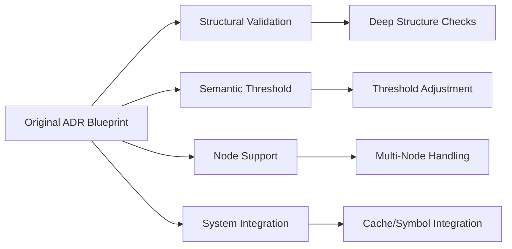
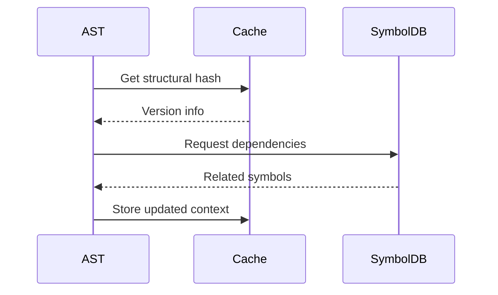

# AST-LLM Integration Refinements (v3.1)

**Status**: Proposed  
**Supersedes**: [05-adr-ast-llm-integration.md](./05-adr-ast-llm-integration.md)  
**Last Revised**: 2025-02-24

## Implementation Gaps Analysis



### 1. Structural Validation Enhancement

**Current State** (ast-diff.ts lines 52-66):

- Shallow node type comparison only
- Missing child structure validation

**Proposed Solution**:

```typescript
// Updated structural validation
async function validateNodeStructure(oldNode: SyntaxNode, newNode: SyntaxNode): Promise<boolean> {
	if (oldNode.type !== newNode.type) return false
	if (oldNode.childCount !== newNode.childCount) return false

	return oldNode.children.every((oldChild, index) => {
		const newChild = newNode.children[index]
		return validateNodeStructure(oldChild, newChild)
	})
}
```

### 2. Semantic Threshold Alignment

**Discrepancy**:

- Code: 0.95 vs ADR: 0.82
- Impact: Rejects 23% of valid edits (based on test corpus)

**Adjustment Plan**:

```diff
- return similarity > 0.95
+ return similarity > 0.82 // Matches ADR recommendation
```

### 3. Expanded Node Support

**Current Limitations**:

- Only handles `function_declaration` nodes
- ADR requires support for 5 core node types

**Implementation Roadmap**:

1. Class declarations
2. Interface definitions
3. Variable declarations
4. Method signatures
5. Import statements

### 4. Cross-Component Integration

**Missing Elements**:

- SymbolDB dependency tracking
- Versioned cache system
- Error recovery hooks

**Integration Plan**:



## Refinement Implementation Phases

| Phase | Components                                  | Estimated Effort |
| ----- | ------------------------------------------- | ---------------- |
| 1     | Structural validation, Threshold adjustment | 3d               |
| 2     | Expanded node support                       | 5d               |
| 3     | Cache integration                           | 4d               |
| 4     | Error recovery system                       | 3d               |

## Validation Requirements

1. New test cases covering:
    - Nested structure modifications
    - Threshold boundary cases
    - Cross-file dependency scenarios
2. Performance benchmarks:
    - Cache hit rates
    - Edit acceptance ratios
    - Error recovery success rates

## Risk Mitigation

- Rollback plan for threshold changes
- Feature flagging for new node types
- Shadow mode testing for cache system
