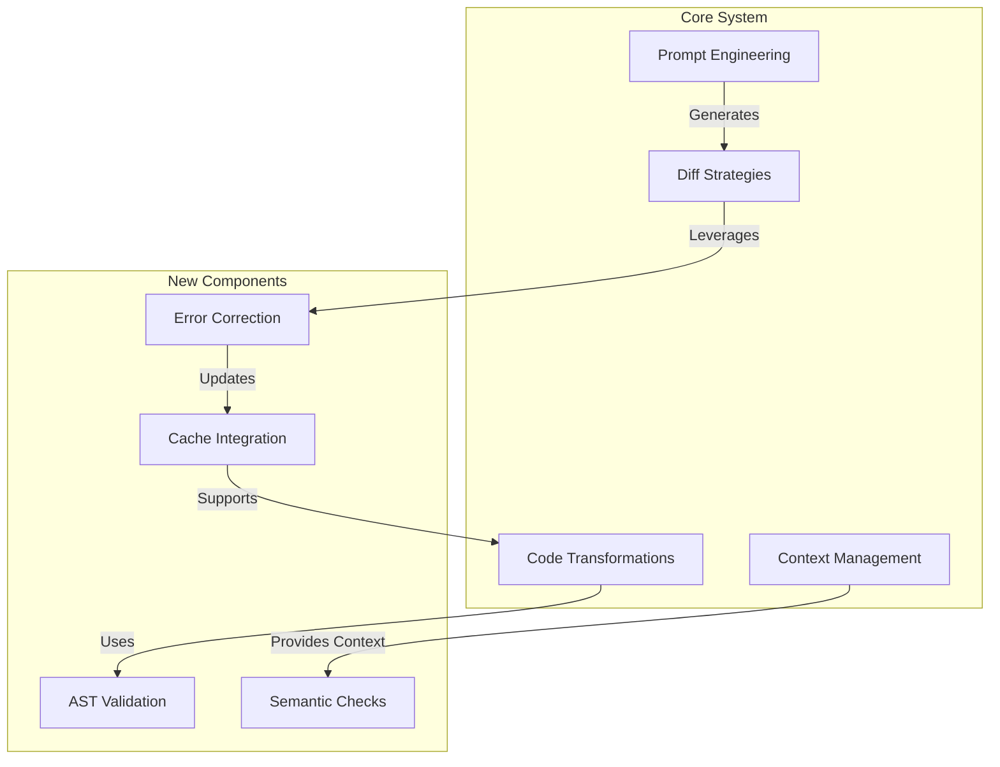
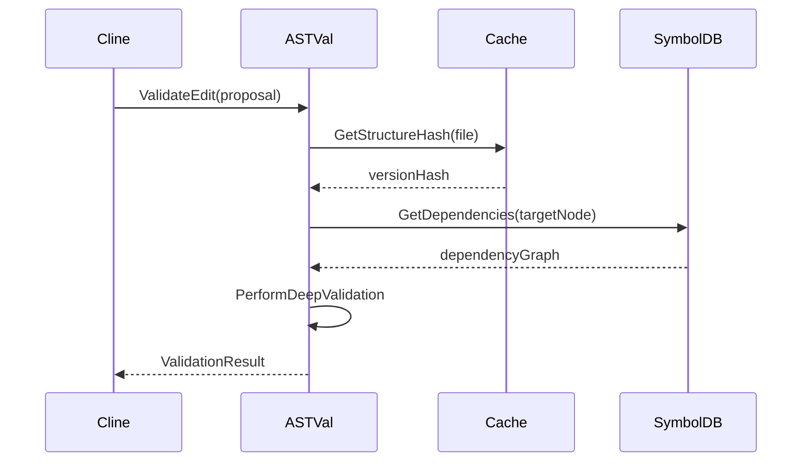
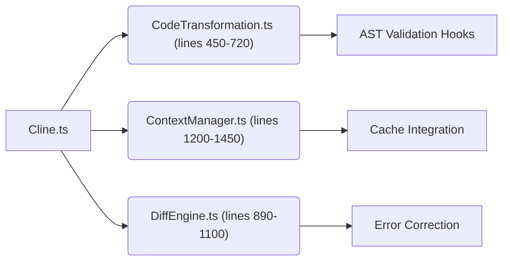

# AST Integration Implementation Guide

## 1. Cline.ts Module Interaction Map



## 2. Core Workflow Sequence Diagrams

### Structural Validation Flow



## 3. Interface Specifications

### AST Validation Service Contract

```yaml
openapi: 3.0.0
info:
    title: AST Validation API
    version: 3.1.0

paths:
    /validate:
        post:
            parameters:
                - name: editProposal
                  in: body
                  required: true
                  schema:
                      $ref: "#/components/schemas/AstEditProposal"
            responses:
                200:
                    description: Validation result
                    schema:
                        $ref: "#/components/schemas/ValidationResult"

components:
    schemas:
        AstEditProposal:
            type: object
            properties:
                targetNode:
                    type: string
                    format: uri
                operation:
                    type: string
                    enum: [replace, insertBefore, insertAfter, delete]
                newContent:
                    type: string
        ValidationResult:
            type: object
            properties:
                isValid:
                    type: boolean
                diagnostics:
                    type: array
                    items:
                        $ref: "#/components/schemas/Diagnostic"
```

## 4. Validation Test Datasets

### Golden Dataset Structure

```typescript
interface TestCase {
	id: string
	description: string
	original: string
	modified: string
	expected: {
		validationResult: boolean
		cacheUpdates: number
		symbolChanges: string[]
	}
}

const testCases: TestCase[] = [
	{
		id: "TC-001",
		description: "Simple function body modification",
		original: `function sum(a: number, b: number): number {
      return a + b;
    }`,
		modified: `function sum(a: number, b: number): number {
      // Optimized implementation
      return a + b;
    }`,
		expected: {
			validationResult: true,
			cacheUpdates: 1,
			symbolChanges: ["sum:1"],
		},
	},
	{
		id: "TC-015",
		description: "Cross-file dependency change",
		original: "import { utils } from './helpers';",
		modified: "import { utilities } from './helpers';",
		expected: {
			validationResult: false,
			cacheUpdates: 0,
			symbolChanges: ["helpers:export*"],
		},
	},
]
```

## Integration Checklist

1. **Cline.ts Modification Points**:



2. **Implementation Phases**:

| Phase | Files Affected        | Key Methods               | LOC Estimate |
| ----- | --------------------- | ------------------------- | ------------ |
| 1     | CodeTransformation.ts | `applyAstAwareEdit()`     | +120/-45     |
| 2     | ContextManager.ts     | `updateStructuralCache()` | +80/-20      |
| 3     | DiffEngine.ts         | `handleSemanticErrors()`  | +150/-60     |
| 4     | Cline.ts              | `mainWorkflow()`          | +40/-10      |

3. **Precision Editing Targets**:

```javascript
// Target 1: CodeTransformation.ts line 512
function applyEdit(proposal) {
  // [AST-EDIT-POINT] Replace with:
  const validation = await astValidator.validate(proposal);
  if (!validation.isValid) throw new Error(validation.diagnostics);
}

// Target 2: DiffEngine.ts line 927
function generateDiff(oldCode, newCode) {
  // [AST-DIFF-INTEGRATION] Insert after:
  const astDiff = await getAstModifications(oldCode, newCode);
  return mergeDiffs(textDiff, astDiff);
}
```
