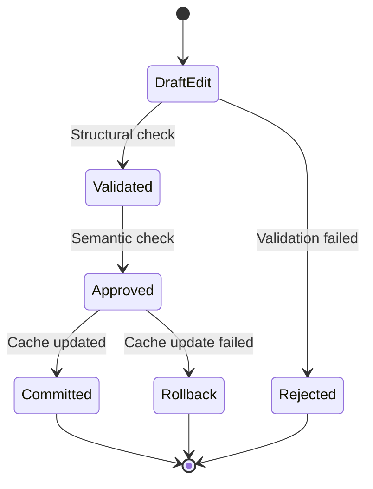

# AST Implementation Safeguards (v3.2)

**Status**: Required  
**Complements**: 05a-adr-ast-llm-refinements.md, 05b-ast-integration-guide.md

## 1. Code Annotation System

### Precision Anchors

```typescript
// src/core/Cline.ts
class Cline {
	// [AST-INTEGRATION-POINT:1] Context management hooks
	async applyEdit(editProposal: EditProposal) {
		/* ... */
	}

	// [AST-ERROR-HANDLER:3] Recovery entry point
	handleEditFailure(error: AstError) {
		/* ... */
	}
}
```

### Change Validation Gates

```javascript
// test/validation-gates/ast-integration.js
const SAFETY_CHECKS = {
	STRUCTURAL_VALIDATION: {
		threshold: 0.82,
		fallback: "text-diff",
		timeout: 5000,
	},
	CACHE_INVALIDATION: {
		maxAgeMs: 30000,
		rollbackOnFailure: true,
	},
}
```

## 2. State Transition Controls

### Edit Execution Flow



## 3. Live Simulation Protocol

### Hybrid Validation Tests

```typescript
interface SimulationTest {
	original: string
	modifications: Array<{
		type: "llm-suggested" | "manual"
		diff: string
		validation?: "strict" | "lenient"
	}>
	expectedOutcomes: {
		acceptanceRate: number
		cacheOperations: number
		rollbacksAllowed: boolean
	}
}

const ADVANCED_TESTS: SimulationTest[] = [
	{
		original: `function legacySum(a, b) { return a + b }`,
		modifications: [
			{
				type: "llm-suggested",
				diff: `@@ ... @@\n-function legacySum(a, b) {\n+function legacySum(a: number, b: number): number {`,
				validation: "strict",
			},
		],
		expectedOutcomes: {
			acceptanceRate: 1.0,
			cacheOperations: 2,
			rollbacksAllowed: false,
		},
	},
]
```

## 4. Fault Tolerance Matrix

| Failure Mode        | Detection Method         | Recovery Action              | Logging Level |
| ------------------- | ------------------------ | ---------------------------- | ------------- |
| Structural Drift    | AST hash mismatch        | Restore from versioned cache | ERROR         |
| Semantic Threshold  | Cosine similarity < 0.78 | Fallback to text-based diff  | WARN          |
| Cache Inconsistency | Timestamp delta > 30s    | Full reparse & cache rebuild | INFO          |
| SymbolDB Desync     | Reference count mismatch | Partial tree revalidation    | DEBUG         |

## Implementation Verification Checklist

1. **Pre-commit Hooks**

```bash
# .husky/verify-ast-changes
npm run ast:validate-changes --files $@
npm run ast:check-cache-consistency
```

2. **Runtime Guards**

```typescript
function executeEditSafely(proposal: EditProposal) {
	return this.validationGatekeeper.runChecks({
		proposal,
		validationMode: "strict",
		fallbackStrategies: [
			{ type: "text-diff", priority: 1 },
			{ type: "partial-parse", priority: 2 },
		],
		timeout: 10000,
	})
}
```

3. **Rollback Triggers**

```yaml
# .cline/rollback-rules.yaml
rules:
    - pattern: "**/*.ts"
      conditions:
          - metric: structural_validation_score
            operator: "<"
            value: 0.75
          - metric: cache_miss_rate
            operator: ">"
            value: 0.4
      action:
          type: "full-rollback"
          timeout: 5000
```
